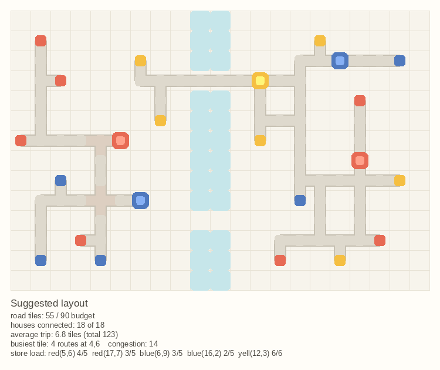

# Mini Motorways Path Optimization

Works out where the roads should go on a Mini Motorways board, and draws the
answer. Boards come from a JSON file, from a small ASCII sketch, or straight off
a screenshot of the running game.



## Setup

```sh
./mm            # builds .venv on first run, then opens the overlay
```

`./mm` forwards anything else straight to `main.py`, so `./mm solve ...` works
too. To set the venv up by hand instead:

```sh
python3 -m venv .venv
./.venv/bin/pip install -e ".[dev]"
```

Screen capture uses `grim` on Wayland and `pyautogui` on X11. `solve` and
`detect` need nothing but numpy and pillow.

## Use

```sh
# plan roads for a board file, write layout.png
python main.py solve boards/riverside.json -o layout.png

# spend tiles to keep the traffic spread out instead of funnelled
python main.py solve boards/riverside.json --spread 1

# best you can do with the roads the board allows
python main.py solve boards/riverside.json --fit-budget

# read a screenshot into a board, check the detections, then plan
python main.py detect shot.png -o board.json --solve

# grab the screen and do all of the above in one go
python main.py capture

# floating panel that re-plans from the screen on a hotkey
python main.py overlay --now
```

`--json` prints the stats as machine-readable JSON instead of a report.

## The overlay

`./mm` opens a small always-on-top panel that reads the board off your screen
and draws the plan. It does nothing until you ask it to: hit **refresh** in the
panel, press **r** while it has focus, or -- the point of the thing -- signal it
from a game hotkey, since the game will have the keyboard, not the panel.

The panel prints its own pid on startup:

```
overlay running as pid 755407
refresh from anywhere:  kill -USR1 755407
```

So bind that in `hyprland.conf`, along with rules to float and pin it out of
the tiling layout:

```
windowrulev2 = float, class:^(Tk)$, title:^(minimotor)$
windowrulev2 = pin, class:^(Tk)$, title:^(minimotor)$
windowrulev2 = noinitialfocus, class:^(Tk)$, title:^(minimotor)$

bind = SUPER, M, exec, pkill -USR1 -f "main.py overlay"
```

It hides itself for a moment before each grab, so it never ends up planning a
picture of itself. A refresh takes a couple of seconds on a full board and runs
off the main thread, so the panel stays responsive while it thinks.

`--geometry 500x700+40+40` places it, `--alpha 0.85` makes it translucent,
`--cell` sets how big the drawn plan is, and every `solve` flag works here too:

```sh
./mm overlay --spread 1 --alpha 0.85 --geometry +1400+60
```

Clicks land on the panel, so keep it in a corner clear of the board. Detection
is the same heuristic `detect` uses, with the same limits -- see below.

## What "optimal" means here

You lose a run when a store's queue overflows, and roads are the resource you
never have enough of. So the planner optimises, in priority order:

1. **Every house reaches a store of its colour.** A house that cannot deliver is
   what eventually ends the run, so this is a hard requirement.
2. **Load is spread evenly across the stores of a colour**, so no single store
   drowns while another idles.
3. **Fewest road tiles.** Roads are the scarce resource.
4. **Shortest trips**, which is what actually raises the score.

Roads in the game are colour-agnostic — any car drives any road — so the whole
map shares one network and re-using an existing tile costs nothing. That single
fact is what makes shared trunk roads fall out of the routing instead of needing
to be engineered in. On the sample boards, sharing cuts the tile count by
**42–84%** against every house laying its own road.

### The congestion trade

Tile count is not the whole story. A layout that saves tiles by funnelling
twenty routes through one junction is a jam waiting to happen, and jams are what
actually end runs. `--spread` prices congestion in road tiles, so you can buy
your way out of a chokepoint:

| `--spread` | tiles | busiest tile | congestion |
| --- | --- | --- | --- |
| 0 | 143 | 28 routes | 873 |
| 0.5 | 190 | 22 routes | 525 |
| 1.0 | 313 | 22 routes | 317 |

At 0 the plan is as small as it can be, chokepoints and all. Raise it and
traffic fans out over more tarmac, which is usually the better trade in a real
game. Roads are shaded by traffic in the rendered PNG, so the jams are visible
without reading the numbers.

## How it works

| file | what it does |
| --- | --- |
| `board.py` | the grid model: houses, stores, water, JSON and ASCII boards |
| `solver.py` | assigns houses to stores, then routes the roads |
| `render.py` | draws a board and its plan to a PNG, shaded by traffic |
| `vision.py` | turns a screenshot into a board (heuristic) |
| `overlay.py` | screen grab, and the floating panel |
| `main.py` | the command line |
| `benchmark.py` | measures layout tightness and runtime |

### Assignment

One Dijkstra sweep per store gives the distance from every cell back to it, so
the full house-to-store cost matrix costs *S* searches rather than *H×S*. The
matching itself is a **min-cost flow** (successive shortest paths with Johnson
potentials), with each store capped at an even share of its colour's houses. So
given those costs the assignment is genuinely optimal, not merely greedy — a
property the test suite checks against brute force on random instances.

### Routing

The shortest-path heuristic for a Steiner forest. Houses are routed one at a
time with Dijkstra over the grid, where a cell already carrying a road costs
nothing and a fresh cell costs one tile — so each new house merges into the
network already on the map rather than laying a parallel road beside it. Ties on
tile count are broken by path length, so a route that costs nothing extra is not
free to wander.

Then two improvement loops run to a fixed point:

- **Rip-up and reroute.** Routing one house at a time means the early routes were
  laid blind to the ones that followed. Each road is torn out and re-laid against
  the finished network, which lets it move onto trunks that did not exist when it
  was first built.
- **Reassignment.** The matching stage minimises distance, which is right before
  any tarmac exists. Once it does, a store that is further away can be the cheaper
  choice because the road to it is already there and paid for. Houses are offered
  every other store of their colour and keep the move if the whole layout improves.
  Capacity is respected, so this cannot undo the load balancing.

Several routing orders are tried and the tightest kept. Minimum-tile connection
is a Steiner forest problem and NP-hard; this gets close, quickly, without
claiming optimality.

## Board files

```json
{
  "width": 21, "height": 14, "road_budget": 90,
  "blocked": [[9, 0], [9, 1]],
  "houses": [{"x": 1, "y": 1, "color": "red"}],
  "stores": [{"x": 5, "y": 6, "color": "red", "capacity": 5}]
}
```

`blocked` is water and scenery — cells no road may cross. Colours are the keys of
`COLORS` in `board.py`.

For anything small, sketch it instead. Lower case is a house, upper case a store,
`~` water:

```python
Board.from_ascii("""
    r . . ~ . R
    r . . ~ . .
""")
```

`u` is purple, because `p` is pink. `Board.to_ascii()` renders it back, so boards
round-trip.

## Reading screenshots

`vision.py` masks the saturated pixels, groups them into blobs, and keeps the
ones that are solid through the middle — which is what rejects the city name and
the scenery, since lettering is hollow in the centre and a building is not.
Building sizes are then cut at their largest gap: the smaller group is houses,
the bigger one stores. Terraces of touching houses merge into one long blob, so
those are sliced back into their pieces rather than dropped. Water is read
separately from the pale blue the game paints it, which has to be told apart from
the pale *mint* the maps wash over land — mint leans green, water leans blue.

This part is heuristic and depends on resolution, zoom and map. Known limits:

- The white border outside the playable map is not detected as blocked, so a plan
  may route through it on maps where the city does not fill the frame.
- Houses packed in a 2×2 block read as one store, since at that point they are
  genuinely the same shape and size as one.

Always look at the `detected.png` preview before trusting a detected board, and
expect to hand-edit the JSON.

## Development

```sh
python -m unittest discover -s tests -v   # 107 tests
ruff check .
mypy
python benchmark.py                       # tightness and runtime
```
